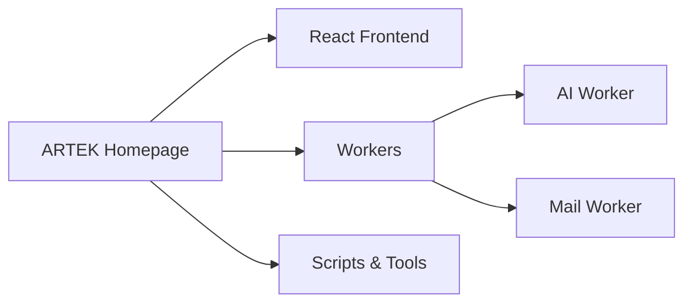
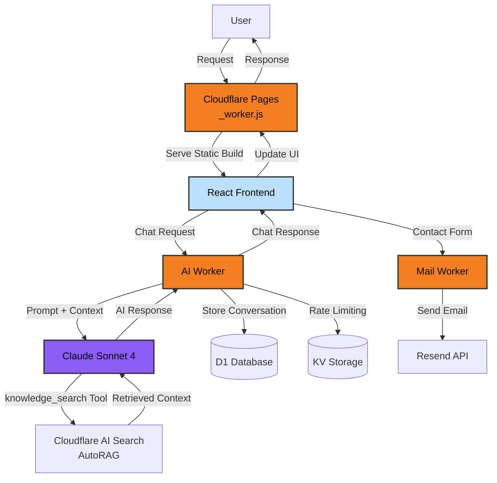

---
Test PR
---

# ARTEK Homepage

[](LICENSE)
[](https://react.dev/)
[](https://www.typescriptlang.org/)
[](https://workers.cloudflare.com/)
[](https://www.anthropic.com/claude)

***ARTEK Homepage***, *React* ve *Carbon Design System* ile oluşturulmuş, çoklu dil desteğine sahip modern kurumsal web sitesi projesidir.

🌐 **Canlı Site:** [www.artek.tc](https://www.artek.tc)

---

## 🏗️ Mimari

Tüm sistem üretim (production) ortamında tamamen `Cloudflare Pages` ve `Workers` üzerinde çalışır.

### Üç Katmanlı Mimari

`ARTEK Homepage` proje mimarisini bütünsel olarak üç ana konsept ile açıklamak mümkündür:

- **React Frontend** son kullanıcı ile etkileşim katmanıdır ve kullanıcı arayüzünü yönetir.
- **Workers** katmanı sistemin backend servisleri olan *AI Worker* ve *Mail Worker* yapılarından oluşur.
- **Scripts & Tools** ise geliştirme ve üretim süreçlerini destekleyen araçlardan oluşur.



### Veri Akışı & Entegrasyonlar



---

## 📁 Proje Yapısı

```
artek-homepage/
├── src/                      
│   ├── pages/               
│   ├── shared/              
│   │   ├── components/     
│   │   ├── hooks/          
│   │   ├── styles/         
│   │   └── translations/   
│   └── router/              
├── workers/                  
│   ├── ai-worker/           
│   │   ├── src/            
│   │   ├── migrations/     
│   │   └── wrangler.jsonc  
│   └── mail-worker/         
│       ├── src/            
│       └── wrangler.jsonc  
├── scripts/                  
│   ├── utils/               
│   └── dashboard/           
├── public/                   
│   └── data/               
└── dist/                     
```

---

## 🎖️ Teşekkürler

Bu proje, aşağıdaki harika açık kaynak projeler olmadan mümkün olamazdı:

- **[React](https://react.dev/)**
- **[React Router](https://reactrouter.com/)**
- **[Carbon Design System](https://carbondesignsystem.com/)**
- **[Cloudflare Workers](https://workers.cloudflare.com/)**
- **[Claude AI](https://www.anthropic.com/claude)**
- **[Vite](https://vite.dev/)**
- **[TypeScript](https://www.typescriptlang.org/)**
- **[Vitest](https://vitest.dev/)**
- **[Playwright](https://playwright.dev/)**
- **[Ethers.js](https://docs.ethers.org/)**

---

## 🤝 Neden Açık Kaynak?

Bilgiyi gizleyen tüketir, paylaşan çoğaltır. Tarih boyunca insanlığın en büyük sıçramaları,
fikirlerin özgürce dolaşabildiği anlarda gerçekleşti. Açık kaynak, bu kadim gerçeğin modern ifadesidir.

Bir fikir, yayıldıkça güçlenir. Eleştirildikçe olgunlaşır. Üzerine eklendikçe büyür.
Bu proje, yalnızca bugün değil yarın da açık kalması için paylaşma cesareti gösteren
([daima açık](LICENSE)) herkesin ortak eseri olmayı hedefliyor.

### AGPL-3.0 Lisansı & Etik Yükümlülük

Bu proje **AGPL-3.0** lisansı altında yayınlanmıştır. Bu, projeyi fork eden veya kendi projelerinde kullanan herkesin de kaynak kodlarını açık tutma **etik yükümlülüğü** altında olduğu anlamına gelir. Network üzerinden servis sağlayan uygulamalar için GPL'in en güçlü versiyonu olan AGPL, açık kaynak felsefesinin devamını garanti altına alır.

**Katkı politikamız için:**
[CONTRIBUTING.md](CONTRIBUTING.md) dosyasına göz atabilirsiniz. (Not: Bu repository harici katkı kabul etmemektedir.)

**Detaylı lisans bilgileri için:**
[LICENSE](LICENSE) dosyasını inceleyebilirsiniz.

---

## 📧 İletişim

**ARTEK İnovasyon Ar-Ge Sanayi ve Tic. Ltd. Şti.**

- 🌐 Web Sitesi: [www.artek.tc](https://www.artek.tc)
- 📧 Genel Sorularınız için: info@artek.tc

**Geliştirici İletişim Bilgileri:**
- 👤 Rıza Emre ARAS
- 📧 r.emrearas@proton.me

---

> *"Dünyada her şey için, medeniyet için, hayat için, muvaffakiyet için en hakiki mürşit ilimdir, fendir.*
> *İlim ve fennin haricinde mürşit aramak gaflettir, cehalettir, dalalettir."*
>
> — **Mustafa Kemal Atatürk**, 22 Eylül 1924, Samsun, İstiklal Ticaret Mektebi Öğretmenlerine Hitaben Yaptığı Konuşma
>
> <sub>[Atatürk'ün Söylev ve Demeçleri, Cilt II, s.349, ATAM Yayınları](http://atam.gov.tr/wp-content/uploads/2024/03/Ataturkun-Soylev-ve-Demecleri-C2.pdf)</sub>

---

<!--suppress HtmlDeprecatedAttribute -->
<div align="center">


</div>

---

<div align="center">

 **© 2025 Artek İnovasyon Arge Sanayi ve Ticaret Limited Şirketi, Tüm hakları saklıdır.**

</div>
